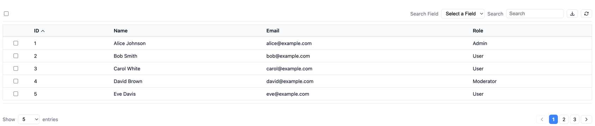

# jtags

A lightweight, server-side rendered UI component library for Java template engines.

## Why jtags?

Modern web development often pushes complexity to the frontend with heavy JavaScript frameworks. jtags takes a different approach:

- **Server-side first** - Logic stays on your server, not in the browser
- **HTML over the wire** - Uses HTMX to swap HTML fragments, no JSON APIs needed
- **Template engine agnostic** - Currently supports Quarkus Qute, with Thymeleaf and others planned
- **Minimal JavaScript** - Only what's needed for interactions
- **Themeable** - CSS variables, BEM classes, or bring your own (Tailwind, Bootstrap, etc.)

## Components

| Component | Status |
|-----------|--------|
| Data Table | ✅ Ready |
| Forms | 🔜 Planned |
| Tabs | 🔜 Planned |
| Cards | 🔜 Planned |

### Data Table



## Data Table Features

- Server-side sorting, pagination, and search
- Configurable page sizes
- Bulk selection (by IDs or by filter)
- Customizable toolbar actions
- Action confirmations
- Bookmarkable URLs
- Icon system with SVG sprites

## Installation

### Requirements

- Java 21+
- Quarkus 3.17+ (tested on 3.17.2)

### Step 1: Add Repository and Dependencies

Add to your `pom.xml`:
```xml
<repositories>
    <repository>
        <id>jitpack.io</id>
        <url>https://jitpack.io</url>
    </repository>
</repositories>

<dependencies>
    <!-- jtags -->
    <dependency>
        <groupId>com.github.felipe-alves-moraes</groupId>
        <artifactId>jtags</artifactId>
        <version>v0.1.0</version>
    </dependency>
    
    <!-- Web Bundler (handles HTMX bundling) -->
    <dependency>
        <groupId>io.quarkiverse.web-bundler</groupId>
        <artifactId>quarkus-web-bundler</artifactId>
        <version>1.9.3</version>
    </dependency>
    
    <!-- HTMX -->
    <dependency>
        <groupId>org.mvnpm</groupId>
        <artifactId>htmx.org</artifactId>
        <version>2.0.4</version>
        <scope>provided</scope>
    </dependency>
</dependencies>
```

### Step 2: Create Entry Point for HTMX

Create `src/main/resources/web/app/main.js`:
```javascript
import 'htmx.org';
```

### Step 3: Add TemplateExtension

Create this class in your project (required until jtags becomes a proper Quarkus extension):
```java
package com.yourpackage;

import io.quarkus.qute.TemplateExtension;
import java.lang.reflect.Method;

@TemplateExtension(namespace = "util")
public class TemplateExtensions {

    public static Object property(Object obj, String propertyName) {
        if (obj == null || propertyName == null) {
            return null;
        }
        try {
            Method method = obj.getClass().getMethod(propertyName);
            return method.invoke(obj);
        } catch (NoSuchMethodException e) {
            try {
                String getterName = "get"
                    + propertyName.substring(0, 1).toUpperCase()
                    + propertyName.substring(1);
                Method getter = obj.getClass().getMethod(getterName);
                return getter.invoke(obj);
            } catch (Exception ex) {
                return null;
            }
        } catch (Exception e) {
            return null;
        }
    }
}
```

### Step 4: Setup Base Template

Create `src/main/resources/templates/base.html`:
```html
<!DOCTYPE html>
<html lang="en">
<head>
    <meta charset="UTF-8">
    <meta name="viewport" content="width=device-width, initial-scale=1.0">
    <title>{#insert title}My App{/}</title>
    
    {#bundle /}
    
    <link rel="stylesheet" href="/css/jtags/jtags-core.css">
    <link rel="stylesheet" href="/css/jtags/jtags-theme.css">
    <script src="/js/jtags/table.js" defer></script>
</head>
<body>
    <main>
        {#insert /}
    </main>
</body>
</html>
```

## Quick Start

### 1. Create Your Data Model
```java
public record User(Long id, String name, String email, String role) {}
```

### 2. Create a Service
```java
@ApplicationScoped
public class UserService {
    
    private List<User> users = new ArrayList<>(List.of(
        new User(1L, "Alice", "alice@example.com", "Admin"),
        new User(2L, "Bob", "bob@example.com", "User"),
        new User(3L, "Charlie", "charlie@example.com", "User")
    ));
    
    public Page<User> findAll(int page, int size, String sortBy, boolean ascending,
                               String searchField, String searchTerm) {
        // Filter
        List<User> filtered = users;
        if (searchField != null && searchTerm != null && !searchTerm.isEmpty()) {
            filtered = users.stream()
                .filter(u -> matchesSearch(u, searchField, searchTerm))
                .toList();
        }
        
        // Sort
        if (sortBy != null) {
            filtered = filtered.stream()
                .sorted(getComparator(sortBy, ascending))
                .toList();
        }
        
        // Paginate
        int start = (page - 1) * size;
        int end = Math.min(start + size, filtered.size());
        List<User> items = filtered.subList(start, end);
        
        return new Page<>(items, page, size, filtered.size());
    }
}
```

### 3. Create Table Configuration
```java
@Path("/users")
public class UserPageResource {

    @Inject
    Template users;
    
    @Inject
    UserService userService;
    
    @GET
    @Produces(MediaType.TEXT_HTML)
    public TemplateInstance get(
            @QueryParam("page") @DefaultValue("1") int page,
            @QueryParam("size") @DefaultValue("10") int size,
            @QueryParam("sort") @DefaultValue("id") String sort,
            @QueryParam("asc") @DefaultValue("true") boolean asc,
            @QueryParam("searchField") String searchField,
            @QueryParam("search") String search) {
        
        var pageData = userService.findAll(page, size, sort, asc, searchField, search);
        
        var config = new TableConfig(
            "/users",                              // baseUrl
            List.of(                               // columns
                new TableColumn("id", "ID"),
                new TableColumn("name", "Name"),
                new TableColumn("email", "Email"),
                new TableColumn("role", "Role")
            ),
            "id",                                  // idField
            true,                                  // showSearch
            Set.of("name", "email", "role"),       // searchableFields
            true,                                  // showCheckbox
            List.of(                               // toolbarActions
                new ToolbarAction("delete", "Delete", "trash", "/api/users", "DELETE", 
                                  true, "Delete selected items?", true, false)
            ),
            false,                                 // showPaginationLabels
            "/icons/jtags/icons.svg",              // iconBasePath
            List.of(5, 10, 25, 50)                 // pageSizeOptions
        );
        
        var state = new TableState<>(pageData, sort, asc, search, searchField);
        
        return users.data("config", config).data("state", state);
    }
}
```

### 4. Create the Template

Create `src/main/resources/templates/users.html`:
```html
{#include base.html}
{#title}Users{/title}

<h1>Users</h1>

{#jtagsTable config=config state=state /}

{/include}
```

### 5. Run and Enjoy
```bash
mvn quarkus:dev
```

Open http://localhost:8080/users

## Configuration

### TableConfig

Main configuration for the table component.

| Field | Type | Description |
|-------|------|-------------|
| `baseUrl` | `String` | URL for HTMX requests (sorting, pagination, search) |
| `columns` | `List<TableColumn>` | Column definitions |
| `idField` | `String` | Property name used as unique identifier (e.g., `"id"`, `"uuid"`) |
| `showSearch` | `boolean` | Show search input and field selector |
| `searchableFields` | `Set<String>` | Fields available for searching |
| `showCheckbox` | `boolean` | Show row selection checkboxes |
| `toolbarActions` | `List<ToolbarAction>` | Toolbar buttons |
| `showPaginationLabels` | `boolean` | Show "Previous"/"Next" text alongside icons |
| `iconBasePath` | `String` | Path to SVG sprite (default: `"/icons/jtags/icons.svg"`) |
| `pageSizeOptions` | `List<Integer>` | Available page sizes (e.g., `List.of(5, 10, 25, 50)`) |
```java
public record TableConfig(
    String baseUrl,
    List<TableColumn> columns,
    String idField,
    boolean showSearch,
    Set<String> searchableFields,
    boolean showCheckbox,
    List<ToolbarAction> toolbarActions,
    boolean showPaginationLabels,
    String iconBasePath,
    List<Integer> pageSizeOptions
) {}
```

---

### TableColumn

Defines a table column.

| Field | Type | Description |
|-------|------|-------------|
| `key` | `String` | Property name to display |
| `label` | `String` | Column header text |
```java
public record TableColumn(String key, String label) {}
```

---

### ToolbarAction

Defines a toolbar button.

| Field | Type | Description |
|-------|------|-------------|
| `key` | `String` | Unique identifier |
| `label` | `String` | Button text / tooltip |
| `icon` | `String` | Icon name (e.g., `"trash"`, `"refresh"`) |
| `url` | `String` | Action endpoint URL |
| `method` | `String` | HTTP method (`"GET"`, `"POST"`, `"DELETE"`, etc.) |
| `confirm` | `boolean` | Show confirmation modal before executing |
| `confirmMessage` | `String` | Modal message (if `confirm` is true) |
| `selectionBased` | `boolean` | Requires selected rows (hidden until selection) |
| `showLabel` | `boolean` | Show label text next to icon (default: `false`) |
```java
public record ToolbarAction(
    String key,
    String label,
    String icon,
    String url,
    String method,
    boolean confirm,
    String confirmMessage,
    boolean selectionBased,
    boolean showLabel
) {}
```

---

### TableState

Holds current table state (passed to template).

| Field | Type | Description |
|-------|------|-------------|
| `page` | `Page<T>` | Paginated data |
| `sortBy` | `String` | Current sort column |
| `ascending` | `boolean` | Sort direction |
| `searchTerm` | `String` | Current search value |
| `searchField` | `String` | Current search field |
```java
public record TableState<T>(
    Page<T> page,
    String sortBy,
    boolean ascending,
    String searchTerm,
    String searchField
) {}
```

---

### Page

Pagination wrapper.

| Field | Type | Description |
|-------|------|-------------|
| `items` | `List<T>` | Current page items |
| `currentPage` | `int` | Current page number (1-based) |
| `pageSize` | `int` | Items per page |
| `totalItems` | `long` | Total items across all pages |

Computed properties (implement these as methods or getters):
- `totalPages` - Total number of pages
- `hasPrevious` - Has previous page
- `hasNext` - Has next page
```java
public record Page<T>(
    List<T> items,
    int currentPage,
    int pageSize,
    long totalItems
) {
    public int totalPages() {
        return (int) Math.ceil((double) totalItems / pageSize);
    }
    
    public boolean hasPrevious() {
        return currentPage > 1;
    }
    
    public boolean hasNext() {
        return currentPage < totalPages();
    }
}
```

---

### Available Icons

Built-in icons (in `/icons/jtags/icons.svg`):

| Icon Name | Usage |
|-----------|-------|
| `sort-asc` | Sort ascending indicator |
| `sort-desc` | Sort descending indicator |
| `trash` | Delete action |
| `archive` | Archive action |
| `refresh` | Refresh action |
| `export` | Export/download action |
| `chevron-left` | Pagination previous |
| `chevron-right` | Pagination next |
| `search` | Search (reserved) |
| `expand` | Expand (reserved) |

## Features

### Sorting

Click any column header to sort. Click again to toggle direction. Sort state is preserved in the URL.

Sorting is server-side - your endpoint receives `sort` and `asc` parameters:
```java
@GET
public TemplateInstance get(
    @QueryParam("sort") @DefaultValue("id") String sort,
    @QueryParam("asc") @DefaultValue("true") boolean asc
) {
    // Apply sorting in your service
}
```

---

### Pagination

Server-side pagination with configurable page sizes.

Parameters received by your endpoint:
- `page` - Current page (1-based)
- `size` - Items per page
```java
@GET
public TemplateInstance get(
    @QueryParam("page") @DefaultValue("1") int page,
    @QueryParam("size") @DefaultValue("10") int size
) {
    // Return paginated data
}
```

---

### Search

Field-specific search with debounced input (300ms delay).

Parameters received:
- `searchField` - Field to search in
- `search` - Search term
```java
@GET
public TemplateInstance get(
    @QueryParam("searchField") String searchField,
    @QueryParam("search") String search
) {
    // Filter in your service
}
```

Only fields listed in `searchableFields` appear in the dropdown.

---

### Row Selection

When `showCheckbox` is enabled:

- Individual row selection via checkboxes
- "Select all" checkbox in toolbar (selects visible rows)
- "Select all matching" banner (selects all items matching current filter)

Selection modes:
- **IDs mode** - Selected row IDs sent as `ids` parameter
- **Filter mode** - Filter parameters sent instead (for bulk operations on large datasets)

---

### Toolbar Actions

Two types of actions:

**Selection-based actions** (`selectionBased: true`)
- Hidden until rows are selected
- Receives selected IDs or filter parameters
- Example: bulk delete, bulk archive

**Global actions** (`selectionBased: false`)
- Always visible
- Not tied to selection
- Example: refresh, export all

#### Handling Actions on Backend
```java
@Path("/api/users")
public class UserApiResource {

    @Inject
    UserService userService;

    @DELETE
    @Path("/bulk")
    public Response bulkDelete(
            @QueryParam("selectionMode") String selectionMode,
            @QueryParam("ids") Set<Long> ids,
            @QueryParam("searchField") String searchField,
            @QueryParam("search") String search) {
        
        if ("filter".equals(selectionMode)) {
            // Delete all matching filter
            userService.deleteByFilter(searchField, search);
        } else {
            // Delete by IDs
            userService.deleteByIds(ids);
        }
        
        return Response.ok()
            .header("HX-Trigger", "table-refresh")
            .build();
    }
}
```

The `HX-Trigger: table-refresh` header tells the table to reload.

---

### Confirmation Modal

Actions with `confirm: true` show a modal before executing.

The modal displays:
- Your custom `confirmMessage`
- Number of selected items (for selection-based actions)
- Confirm / Cancel buttons

---

### Bookmarkable URLs

All state is preserved in the URL:
- Sort column and direction
- Current page
- Page size
- Search field and term

Users can bookmark or share filtered views. Browser back/forward navigation works as expected.

## Theming

### CSS Architecture

jtags uses a two-file CSS approach:

| File | Purpose |
|------|---------|
| `jtags-core.css` | Layout, structure, functional styles (always required) |
| `jtags-theme.css` | Colors, spacing, visual styling (optional) |

---

### CSS Variables

Override these variables to customize the theme:
```css
:root {
    /* Colors */
    --jtags-primary: #3b82f6;
    --jtags-primary-hover: #2563eb;
    --jtags-danger: #ef4444;
    --jtags-danger-hover: #dc2626;
    --jtags-text: #111827;
    --jtags-text-muted: #6b7280;
    --jtags-border: #e5e7eb;
    --jtags-bg: #ffffff;
    --jtags-bg-hover: #f9fafb;
    --jtags-bg-selected: #eff6ff;
    --jtags-bg-banner: #fef3c7;
    --jtags-bg-modal: rgba(0, 0, 0, 0.5);

    /* Spacing */
    --jtags-spacing-xs: 0.25rem;
    --jtags-spacing-sm: 0.5rem;
    --jtags-spacing-md: 1rem;
    --jtags-spacing-lg: 1.5rem;

    /* Border radius */
    --jtags-radius: 0.375rem;

    /* Typography */
    --jtags-font-family: system-ui, -apple-system, sans-serif;
    --jtags-font-size: 0.875rem;
}
```

Example - dark theme:
```css
:root {
    --jtags-text: #f3f4f6;
    --jtags-text-muted: #9ca3af;
    --jtags-border: #374151;
    --jtags-bg: #111827;
    --jtags-bg-hover: #1f2937;
    --jtags-bg-selected: #1e3a5f;
    --jtags-bg-banner: #78350f;
    --jtags-bg-modal: rgba(0, 0, 0, 0.75);
}
```

---

### Using with Tailwind

Skip `jtags-theme.css` and style using Tailwind classes via BEM selectors:
```html
<head>
    <link rel="stylesheet" href="/css/jtags/jtags-core.css">
    <!-- No jtags-theme.css -->
    <script src="https://cdn.tailwindcss.com"></script>
</head>
```

Target BEM classes in your CSS:
```css
@layer components {
    .jtags-table__header {
        @apply bg-gray-100 text-gray-900 font-semibold px-4 py-2;
    }
    
    .jtags-table__cell {
        @apply px-4 py-2 border-b border-gray-200;
    }
    
    .jtags-table__row:hover .jtags-table__cell {
        @apply bg-gray-50;
    }
    
    .jtags-table__action {
        @apply inline-flex items-center gap-1 px-3 py-1 rounded border border-gray-300;
    }
    
    .jtags-table__action:hover {
        @apply bg-gray-100 border-blue-500;
    }
    
    .jtags-table__action--selection {
        @apply border-red-500 text-red-500;
    }
    
    .jtags-table__action--selection:hover {
        @apply bg-red-500 text-white;
    }
    
    .jtags-pagination__link {
        @apply px-3 py-1 border rounded;
    }
    
    .jtags-pagination__link--active {
        @apply bg-blue-500 text-white border-blue-500;
    }
    
    .jtags-pagination__link--disabled {
        @apply opacity-50 cursor-not-allowed;
    }
}
```

---

### BEM Class Reference

| Class | Element |
|-------|---------|
| `.jtags-table` | Container |
| `.jtags-table__toolbar` | Toolbar wrapper |
| `.jtags-table__toolbar-left` | Left side (checkbox, selection actions) |
| `.jtags-table__toolbar-right` | Right side (search, global actions) |
| `.jtags-table__banner` | Selection banner |
| `.jtags-table__grid` | Table element |
| `.jtags-table__header` | Table header cell |
| `.jtags-table__header--sortable` | Sortable header |
| `.jtags-table__header--checkbox` | Checkbox column header |
| `.jtags-table__row` | Table row |
| `.jtags-table__cell` | Table cell |
| `.jtags-table__cell--checkbox` | Checkbox cell |
| `.jtags-table__action` | Action button |
| `.jtags-table__action--selection` | Selection-based action |
| `.jtags-table__action--global` | Global action |
| `.jtags-table__action-label` | Action button label |
| `.jtags-table__footer` | Footer wrapper |
| `.jtags-table__page-size` | Page size selector |
| `.jtags-pagination` | Pagination nav |
| `.jtags-pagination__list` | Pagination list |
| `.jtags-pagination__item` | Pagination item |
| `.jtags-pagination__link` | Pagination link |
| `.jtags-pagination__link--prev` | Previous link |
| `.jtags-pagination__link--next` | Next link |
| `.jtags-pagination__link--active` | Active page |
| `.jtags-pagination__link--disabled` | Disabled link |
| `.jtags-modal` | Modal overlay |
| `.jtags-modal__content` | Modal content box |
| `.jtags-icon` | SVG icon |
| `.jtags-hidden` | Utility: hidden element |

---

### Custom Icons

Provide your own SVG sprite with the same symbol IDs:
```xml
<svg xmlns="http://www.w3.org/2000/svg" style="display: none;">
    <symbol id="jtags-icon-trash" viewBox="0 0 24 24">
        <!-- your icon path -->
    </symbol>
    <symbol id="jtags-icon-refresh" viewBox="0 0 24 24">
        <!-- your icon path -->
    </symbol>
    <!-- ... -->
</svg>
```

Point to your sprite in config:
```java
var config = new TableConfig(
    // ...
    "/icons/my-icons.svg",  // iconBasePath
    // ...
);
```

Required symbol IDs:
- `jtags-icon-sort-asc`
- `jtags-icon-sort-desc`
- `jtags-icon-chevron-left`
- `jtags-icon-chevron-right`
- Plus any icons used in your `ToolbarAction` definitions

## Examples

### Basic Table (Read-Only)
```java
var config = new TableConfig(
    "/users",
    List.of(
        new TableColumn("id", "ID"),
        new TableColumn("name", "Name"),
        new TableColumn("email", "Email")
    ),
    "id",
    false,                    // no search
    Set.of(),                 // no searchable fields
    false,                    // no checkboxes
    List.of(),                // no actions
    true,                     // show pagination labels
    "/icons/jtags/icons.svg",
    List.of(10, 25, 50)
);
```

---

### Table with Search
```java
var config = new TableConfig(
    "/products",
    List.of(
        new TableColumn("sku", "SKU"),
        new TableColumn("name", "Product Name"),
        new TableColumn("category", "Category"),
        new TableColumn("price", "Price")
    ),
    "sku",
    true,                                    // enable search
    Set.of("name", "category"),              // searchable fields
    false,
    List.of(),
    false,
    "/icons/jtags/icons.svg",
    List.of(10, 25, 50, 100)
);
```

---

### Table with Bulk Actions
```java
var config = new TableConfig(
    "/orders",
    List.of(
        new TableColumn("id", "Order #"),
        new TableColumn("customer", "Customer"),
        new TableColumn("total", "Total"),
        new TableColumn("status", "Status")
    ),
    "id",
    true,
    Set.of("customer", "status"),
    true,                                    // enable checkboxes
    List.of(
        new ToolbarAction(
            "delete", 
            "Delete", 
            "trash", 
            "/api/orders/bulk", 
            "DELETE", 
            true,                            // confirm
            "Delete selected orders?", 
            true,                            // selection-based
            false                            // icon only
        ),
        new ToolbarAction(
            "archive", 
            "Archive", 
            "archive", 
            "/api/orders/archive", 
            "POST", 
            true, 
            "Archive selected orders?", 
            true, 
            false
        )
    ),
    false,
    "/icons/jtags/icons.svg",
    List.of(10, 25, 50)
);
```

---

### Table with Global Actions
```java
var config = new TableConfig(
    "/reports",
    List.of(
        new TableColumn("id", "ID"),
        new TableColumn("name", "Report"),
        new TableColumn("generatedAt", "Generated"),
        new TableColumn("size", "Size")
    ),
    "id",
    true,
    Set.of("name"),
    false,                                   // no checkboxes
    List.of(
        new ToolbarAction(
            "refresh", 
            "Refresh", 
            "refresh", 
            "/reports", 
            "GET", 
            false,                           // no confirm
            null, 
            false,                           // global action
            true                             // show label
        ),
        new ToolbarAction(
            "export", 
            "Export CSV", 
            "export", 
            "/api/reports/export", 
            "GET", 
            false, 
            null, 
            false, 
            true
        )
    ),
    true,
    "/icons/jtags/icons.svg",
    List.of(25, 50, 100)
);
```

---

### Complete Backend Example
```java
@Path("/users")
public class UserResource {

    @Inject
    Template users;
    
    @Inject
    @Location("fragments/user-table.html")
    Template tableFragment;
    
    @Inject
    UserService userService;

    // Full page
    @GET
    @Produces(MediaType.TEXT_HTML)
    public TemplateInstance page(
            @QueryParam("page") @DefaultValue("1") int page,
            @QueryParam("size") @DefaultValue("10") int size,
            @QueryParam("sort") @DefaultValue("id") String sort,
            @QueryParam("asc") @DefaultValue("true") boolean asc,
            @QueryParam("searchField") String searchField,
            @QueryParam("search") String search) {
        
        return users
            .data("config", buildConfig())
            .data("state", buildState(page, size, sort, asc, searchField, search));
    }
    
    // Fragment for HTMX requests
    @GET
    @Path("/table")
    @Produces(MediaType.TEXT_HTML)
    public TemplateInstance table(
            @QueryParam("page") @DefaultValue("1") int page,
            @QueryParam("size") @DefaultValue("10") int size,
            @QueryParam("sort") @DefaultValue("id") String sort,
            @QueryParam("asc") @DefaultValue("true") boolean asc,
            @QueryParam("searchField") String searchField,
            @QueryParam("search") String search) {
        
        return tableFragment
            .data("config", buildConfig())
            .data("state", buildState(page, size, sort, asc, searchField, search));
    }
    
    private TableConfig buildConfig() {
        return new TableConfig(
            "/users/table",
            List.of(
                new TableColumn("id", "ID"),
                new TableColumn("name", "Name"),
                new TableColumn("email", "Email"),
                new TableColumn("role", "Role")
            ),
            "id",
            true,
            Set.of("name", "email", "role"),
            true,
            List.of(
                new ToolbarAction("delete", "Delete", "trash", 
                    "/api/users/bulk", "DELETE", true, 
                    "Delete selected users?", true, false)
            ),
            false,
            "/icons/jtags/icons.svg",
            List.of(5, 10, 25, 50)
        );
    }
    
    private TableState<User> buildState(int page, int size, String sort, 
                                         boolean asc, String searchField, 
                                         String search) {
        var pageData = userService.findAll(page, size, sort, asc, searchField, search);
        return new TableState<>(pageData, sort, asc, search, searchField);
    }
}
```

Fragment template (`templates/fragments/user-table.html`):
```html
{#jtagsTable config=config state=state /}
```

## Roadmap

| Feature | Status |
|---------|--------|
| Data Table | ✅ Ready |
| Pagination | ✅ Ready |
| Quarkus Qute support | ✅ Ready |
| Proper Quarkus Extension | 🔜 Planned |
| Row actions (edit, view, delete) | 🔜 Planned |
| Inline editing | 🔜 Planned |
| Multiple tables per page | 🔜 Planned |
| Thymeleaf support | 🔜 Planned |
| Custom modal support | 🔜 Planned |

---

## Backlog

| Item | Priority |
|------|----------|
| Create proper Quarkus extension (auto-register TemplateExtensions) | High |
| Split documentation (README + /docs folder) | Medium |
| Row actions (edit, view, delete per row) | Medium |
| Inline editing | Medium |
| Multiple tables per page | Low |
| Custom modal support (bring your own) | Low |
| Thymeleaf support | Low |
| Configurable URL push (hx-push-url) | Low |
| Evaluate RSCSS as alternative to BEM | Low |
| Evaluate Web Components for UI widgets (modal, tooltips) - HTMX 2.0 compatible | Low |
| Bundle PDF.js with jtags (zero-config for users) | Medium |

## Contributing

Contributions are welcome! Here's how you can help:

1. **Report bugs** - Open an issue describing the problem
2. **Suggest features** - Open an issue with your idea
3. **Submit PRs** - Fork, create a branch, make changes, open a PR

### Development Setup
```bash
# Clone
git clone https://github.com/felipe-alves-moraes/jtags.git
cd jtags

# Build
mvn clean install

# Run demo
cd demo
mvn quarkus:dev
```

### Code Style

- Java: Follow standard Java conventions
- CSS: BEM naming, prefix with `jtags-`
- JS: Vanilla JS, no frameworks

---

## License

MIT License

Copyright (c) 2025 Felipe Alves de Moraes

Permission is hereby granted, free of charge, to any person obtaining a copy
of this software and associated documentation files (the "Software"), to deal
in the Software without restriction, including without limitation the rights
to use, copy, modify, merge, publish, distribute, sublicense, and/or sell
copies of the Software, and to permit persons to whom the Software is
furnished to do so, subject to the following conditions:

The above copyright notice and this permission notice shall be included in all
copies or substantial portions of the Software.

THE SOFTWARE IS PROVIDED "AS IS", WITHOUT WARRANTY OF ANY KIND, EXPRESS OR
IMPLIED, INCLUDING BUT NOT LIMITED TO THE WARRANTIES OF MERCHANTABILITY,
FITNESS FOR A PARTICULAR PURPOSE AND NONINFRINGEMENT. IN NO EVENT SHALL THE
AUTHORS OR COPYRIGHT HOLDERS BE LIABLE FOR ANY CLAIM, DAMAGES OR OTHER
LIABILITY, WHETHER IN AN ACTION OF CONTRACT, TORT OR OTHERWISE, ARISING FROM,
OUT OF OR IN CONNECTION WITH THE SOFTWARE OR THE USE OR OTHER DEALINGS IN THE
SOFTWARE.